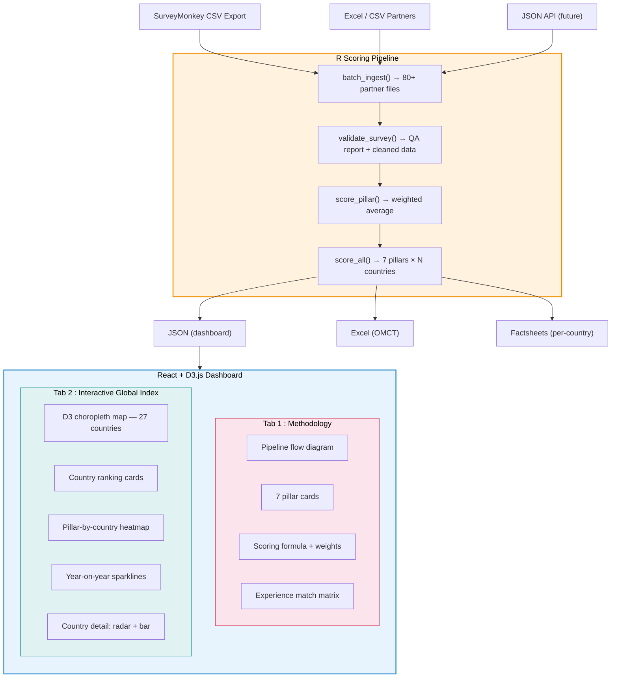

# 🔴 Global Torture Index 2026 — Technical Proposal

### Full-Stack Data Pipeline & Interactive Dashboard

**A working prototype demonstrating end-to-end capability for the OMCT GTI 2026 Data Analysis Consultancy**

[Live Demo](https://gti-2026-proposal.vercel.app) · [R Pipeline Code](#r-scoring-pipeline) · [Architecture](#system-architecture) · [Contact](#contact)

---

---

## What Is This?

This repository is a **technical proposal** for the [OMCT Open Call for Consultant: Data Analysis for the 2026 Global Torture Index](https://www.omct.org/en/careers/open-call-for-consultant-data-analysis-for-the-2026-global-torture-index).

Instead of submitting a traditional letter of interest, I built the actual deliverable — a fully functional R scoring pipeline connected to a React + D3.js interactive dashboard — to demonstrate that I can execute every task in the Terms of Reference on day one.

**This is not a concept. This is a working system.**

The prototype replicates the exact GTI methodology as documented in the [OMCT 2025 Methodology Note](https://www.omct.org/site-resources/files/OMCT-GLOBAL-TORTURE-INDEX-2025-METHODOLOGY-NOTE.pdf):

- 7 thematic pillars, 440 unique indicators, 3 weight tiers (1 / 5 / 10)
- Penalised weighted-average scoring with missing-data penalty
- 5-tier risk classification (Very High → Low)
- Transparency & Access to Information scoring
- 27 countries across 5 regions (Africa, Americas, Europe & Central Asia, Asia, MENA)

> All data displayed is **synthetic** (generated via seeded random for reproducibility). The system is designed to ingest real SurveyMonkey CSV/Excel the moment data becomes available.

---

## Why This Proposal Exists

The GTI consultancy requires:

| OMCT Requirement | What This Repo Proves |
|---|---|
| Verify and clean Excel data from partners | `validate_survey()` — schema check, dedup, range validation, cross-partner consistency |
| Develop R scripts for scoring & aggregation | `score_all()` — exact weighted-average + penalty formula |
| Ensure 2025→2026 longitudinal comparability | `compare_years()` — delta analysis, band-shift detection |
| Produce country scores and comparison reports | `export_excel()` — 3-sheet formatted workbook with conditional formatting |
| Support data visualisation for the GTI webpage | This entire React + D3.js dashboard — choropleth, radar, heatmap, trends |
| Provide technical support to the GTI team | Full documentation, modular codebase, JSON API contract |

---

## System Architecture

## System Architecture

> **Scoring formula** — `Σ(wᵢ × xᵢ) / Σ(wᵢ) × 100 − penalty`
>
> **Data flow** — R → JSON → Dashboard → Browser
>
> **Upload** — drag-drop R JSON to switch from demo data
